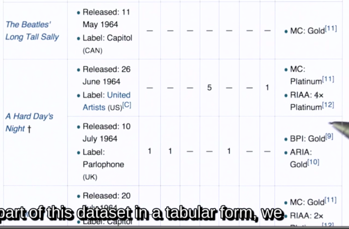

##csv
对于csv文件最好用python的csv模块,自己解析可能会出现问题.比如一个field的value里本身就有都好,这样split是就会多出一个.
用csv.DictReader可以直接将csv文件的每行转为一个dict.
一般csv的第一行都是header,即dict的key.
```
def parse_file_with_csv(file):
    data = []
    with open(file, 'rb') as f:
        f_dict = csv.DictReader(f)
        for item in f_dict:
            data.append(item)
    return data
```
如果自己解析,就用enumerate把list转为(index, list[index])
```
def parse_file(file):
    data = []
    with open(file, 'rb') as f:
        header = f.readline().rstrip().split(',')
        counter = 0            
        for line in f:
            if counter == 10:
                break
            fields = line.rstrip().split(',')
            entry = {}
            for i, value in enumerate(fields):
                entry[header[i].strip()] = value.strip()
            data.append(entry)
            counter += 1
    return data
```
##xls
用xlrd.
```
    workbook = xlrd.open_workbook(datafile)
    sheet = workbook.sheet_by_index(0)

    ### example on how you can get the data
    sheet_data = [[sheet.cell_value(r, col) for col in range(sheet.ncols)] for r in range(sheet.nrows)]
    ## other useful methods:
    print "\nROWS, COLUMNS, and CELLS:"
    print "Number of rows in the sheet:", 
    print sheet.nrows
    print "Type of data in cell (row 3, col 2):", 
    print sheet.cell_type(3, 2)
    print "Value in cell (row 3, col 2):", 
    print sheet.cell_value(3, 2)
    print "Get a slice of values in column 3, from rows 1-3:"
    print sheet.col_values(3, start_rowx=1, end_rowx=4)

    print "\nDATES:"
    print "Type of data in cell (row 1, col 0):", 
    print sheet.cell_type(1, 0)
    exceltime = sheet.cell_value(1, 0)
    print "Time in Excel format:",
    print exceltime
    print "Convert time to a Python datetime tuple, from the Excel float:",
    print xlrd.xldate_as_tuple(exceltime, 0)
```
##表格里还有表格的情况

实在是不好表示,所以换json了.
##JSON
像这种表中还有表的,在JSON里就是一个list,比如


##JSON用来存储数据的特点
- 条目可能有不同的fields
- 可能有嵌套物体
- 可鞥有嵌套数组
##JSON例子
从musicbrainz请求数据,返回JSON,用python解析.
```
import json
import requests


BASE_URL = "http://musicbrainz.org/ws/2/"
ARTIST_URL = BASE_URL + "artist/"

query_type = {  "simple": {},
                "atr": {"inc": "aliases+tags+ratings"},
                "aliases": {"inc": "aliases"},
                "releases": {"inc": "releases"}}


def query_site(url, params, uid="", fmt="json"):
    params["fmt"] = fmt
    r = requests.get(url + uid, params=params)
    print "requesting", r.url

    if r.status_code == requests.codes.ok:
        return r.json()
    else:
        r.raise_for_status()


def query_by_name(url, params, name):
    params["query"] = "artist:" + name
    return query_site(url, params)


def pretty_print(data, indent=4):
    if type(data) == dict:
        print json.dumps(data, indent=indent, sort_keys=True)
    else:
        print data


def main():
    results = query_by_name(ARTIST_URL, query_type["simple"], "Nirvana")
    pretty_print(results)

    artist_id = results["artists"][1]["id"]
    print "\nARTIST:"
    pretty_print(results["artists"][1])

    artist_data = query_site(ARTIST_URL, query_type["releases"], artist_id)
    releases = artist_data["releases"]
    print "\nONE RELEASE:"
    pretty_print(releases[0], indent=2)
    release_titles = [r["title"] for r in releases]

    print "\nALL TITLES:"
    for t in release_titles:
        print t


if __name__ == '__main__':
    main()

```
