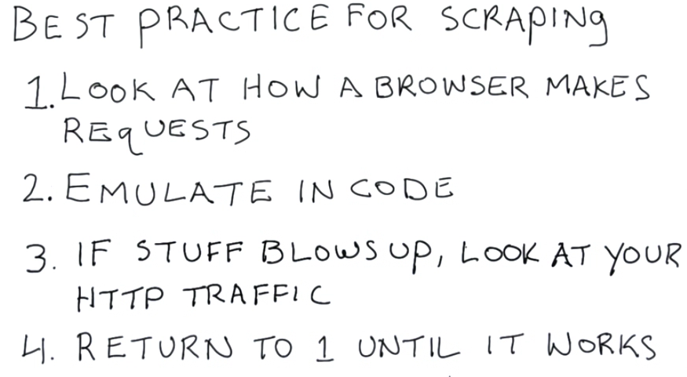

##XML
用xml.etree.ElementTree解析,先找到root,之后用xpath找子节点.
##XPATH
找到后进一步寻找可以用node.find或者node.finall('asd'),找到后用Node.text返回内容
##爬数据
从HTML中爬,用beautifulsoup,和xml相似.
##从网站的表单中获取
大概流程
- 1.用inspect element找到form对于的id
- 2.用soup的find(id=id)
- 3.再用find_all(type='hidden')找到所有的隐藏内容(在Inspect element里,submit一次,在network里知道这个表单都提交了什么数据)
- 4.把所有内容拼成一个dict,用request.post转成http请求提交
- 5.如果请求失败,可能有cookie,用request.session

参考这个图