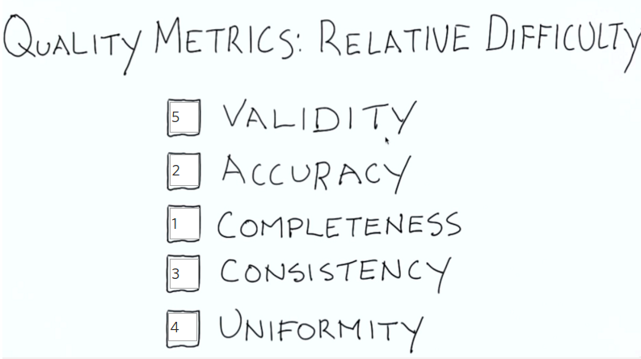
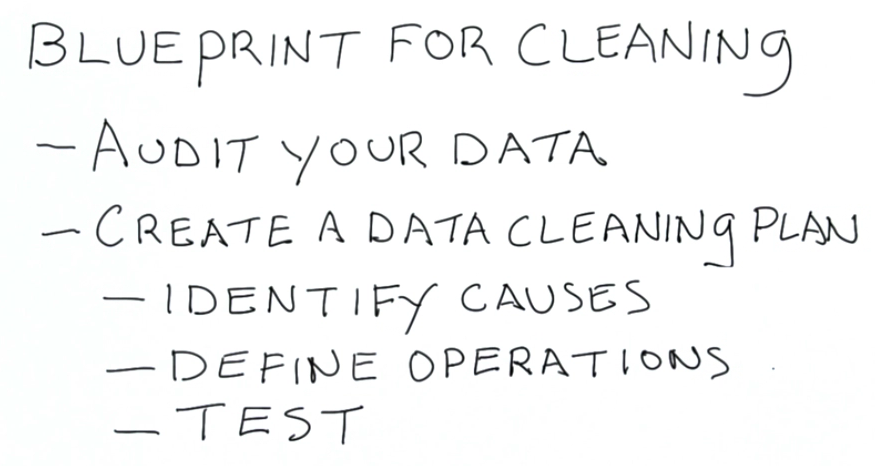
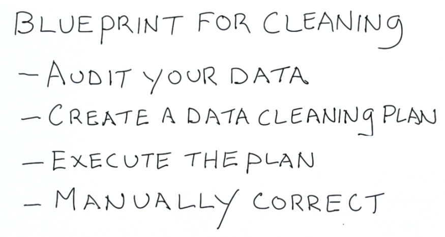

##数据质量
获取到的数据存在各种问题,大概分为这些,要从这几个方面去清洗.

##大概的清洗步骤
不断地按照这个流程一遍一遍尝试.
首先是要检查数据(audit),然后制定机会,方法是找到所有数据不正常的原因,对每种情况手动作出调整方案.
比如统计街道时,有的是Rd.  , 有的是Road. 结尾,这些要统一起来.

##1. Audit
检查数据的方法与cross-field constraints.
比如数据中有人口,面积,以及人口密度.检查方法是:确认数据中的人口/面积 大概等于 数据中的人口密度.
(因为这些数据都是人手工输入,可能会有错).
或者检查是不是有的是two,有的是2,总之就是输入规范不一样.
##2. Accuracy
尽量转为标准,比如所有的国家名称转为ISO 3166.即,找一个参考数据reference data.
##3. Completeness
这个很难做到因为you don't know what you don't know.解决办法也是找一个参考数据reference data.
##4. Consistency
有些数据随着时间会变,比如公司的名称,从KM到KMRT.处理是要注意到这些.
##5. Uniformity
某列数据使用同一种计量单位,计量格式,比如经纬度,有的是-90到90,有的34 25 00 N.是同一个意思但是格式不一样.