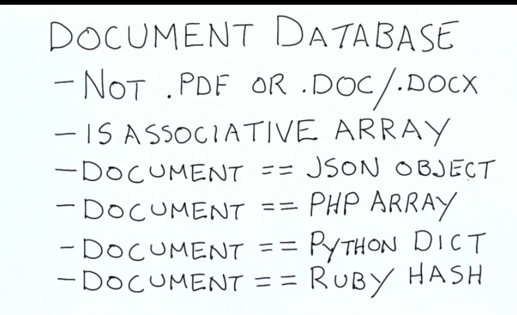
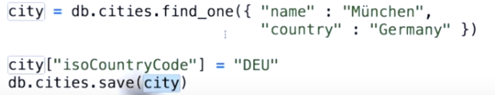
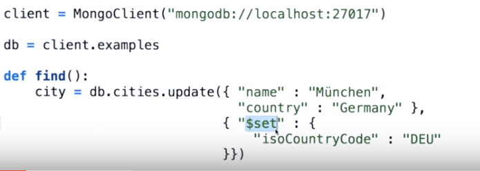
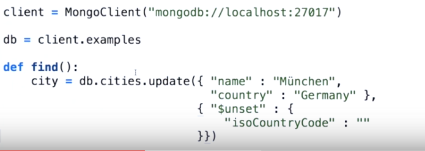
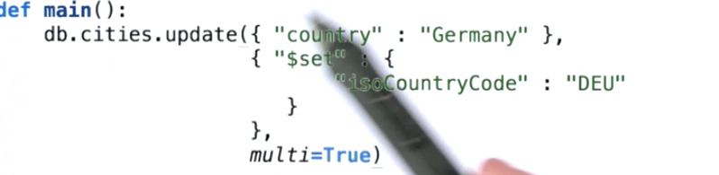

##MongoDB
是一种文档型数据库.特点是field的value可以是数组或者另一个词典(另一个文档).

它是为大数据设计的,有aggregation feamework.

##结构灵活
一个例子是:有人有3个老婆,有人有一个,在传统数据库i里不好存,但是用mongodb,存一个数组就行了.
##PyMongo
MongoDB有一个deamon一直在运行,python用pymongo这个driver和mongodb的deamon通信,数据传输是用BSON,
binary json.

##查询 Query
查询用find和find_one,第一个可能返回多个文档.
格式是
```
db.collection_name.find( query )
query可能是
{"name" : "asd", "gender" : "unknown" .......}
```
##查询返回 Projection
直接用find返回的是每条记录的所有内容,当不想返回所有内容时,可以给find加第二个参数,称为projection.

比如
```
projection = { "_id" : 0, "name" : 1}
db.collection_name.find(query, projection)
```
表示只返回name,总之把要返回的field后面设为1.如果不写"_id": 0,默认都会返回_id.
##插入 insert
只要是词典类型,直接插入就行.比如
```
a = {
    "name" : "asd",
    "qwe" : 123
}
db.collection_name.insert(a)
```
对从wikipedia上下下来的数据,首先把xml转成一个词典的数组,对这个数据依次插入数据库.
##导入JSON import
对于JSON格式的文件可以直接导入.
```
mongoimport -d examples(数据库名) -c mycollection(表名) --file data.json
```
##运算符
运算符就是><=exist之类,但在mongodb里,运算符的用法就像其他filed names一样,但都以$开头.
###1.范围
```
$lt
$gt
$lte
$gte
$ne 不等于
比如
    query = {'foundingDate': {
                              '$gte':datetime(2001, 1, 1),
                              '$lt':datetime(2100, 1, 1)
                              }
             }
```
###2.存在exists
```
db.cities.find( { "governmentType" : {"$exists" : 0} }).count() #这个field不存在的
db.cities.find( { "governmentType" : {"$exists" : 1} }).count() #这个field存在的
```
###3.正则表达式
```
db.cities.find( { "motto" : {"$regex" : [Ff]riendship | [Pp]ride} }).pretty() 
```
###4.查询数组,in,all
可以查询数组中的一个值.
```
data = {
    {"years":[
                    1999,
                    2000,
                    2001]
    }
}
db.collection.find( {"years" : 1999} ).pretty()
```
也可以用in,所有在in中出现过的,都会被查询出来
```
db.collection.find( {"years" : {"$in" : [1999,2000,2001]}}} ).pretty()
```
和in相对的一个是all,文档必须全部满足all给出的才能查询出.
```
db.collection.find( {"years" : {"$all" : [1999,2000,2001]}}} ).pretty()
```
###5.查询嵌套文档
对于文档中有文档的嵌套类型,可以用.来进一步寻找.
```
比如car这个collection.
{
    "_id" : 123123123123,
    "dimensions" : {
        "width" : 2,
        "height" : 3
    }
}
db.car.find( {"dimensions.with" : {"$gt" : 2}} ).pretty()
或者,这个数组不为空的
db.collection.find( {"entities.hashtags" : {"$ne" : []}} )
```
###6更新 update
第一种是用save

第二种是用update和set,set会给这个文档添加一个或多个fields.update的查询方法和find一样.

与set相对的是unset,先用update的第一个参数找到记录,然后把unset制定的field删掉.

需要注意的是,更新时候一定要记着用set运算符,否则,整个被查询出的文档会被替换掉,而不是添加一条field.
####更新多条记录
加一个multi=True参数

###7.删除文档
还是和find一样,只不过remove会删除掉查询掉的文档.
如果是db.collection.remove(),由于没有指定查询,就像find一样,会找到所有文档,所以这个命令会删除掉所有文档,一条一条地.
与之相似的是db.collection.drop(),效率更高,会删掉meta数据,包括所以.