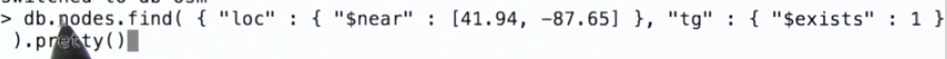

##Aggregation Framework
Aggregation是mongoDB的一个用来分析数据的框架,类似mapreduce,使用pipeline一层一层传递分析.

比如要统计发送tweet最多的用户,做法如下.

- 1.按照用户分组
- 2.对每个用户统计tweet数目.
- 3.排序.
- 4.选择.
这个过程可以用aggregation的pipeline实现.类似于spark和hadoop里的mapreduce.

注意其中的语法,要按照哪一个field分组,要在field名前加上$.
##Pipeline

aggregation的每一级都产生新的数据(文档).

在group的时候可以对分好组的文档进行一些运算,比如统计通常用$sum,$avg之类.
##aggregation的运算符
$group和$sort.

$project,和之前find里的project参数一样,就是选择要输出到下一层的fields.

$match,只把满足条件的文档输出到下一层,即过滤.

$skip,用来跳过几个文档.

$limit 只取前几个.

$unwind,这个最强大,可以把文档里的数组field解开,比如一个field "a"是[1,2,3,4],用unwind可以把这个文档分成4个单独文档,每个的field "a"分别是1,2,3,4,其他内容都一样.
###$MATCH
找出follower和friend比例最大的用户.用Match找到followers 和 friends大于0的用户.

###$PROJECT
project可以创建新的field,传到下一层,新的field可以是用运算符计算出来的,也可以是原来就有的field重命名一下.方法如上图.

###$UNWIND
unwind解开数组里的内容后,可以重新用group分组了,通常分组就是用unwind解开后的field来分.
比如这个例子是解开了一条tweet中,提及的用户名,再用提及用户名分组统计

###$GROUP
group可以做很多统计,如下图,

比如avg可以求均值.这个例子是先对每条tweet的标签展开,用标签分组,统计每个标签对应的所有tweet的转发量的平均值.

####$push和$addtoset
group中还有两个比较重要,push就是添加到数组,会有重复的.addtoset是添加到一个集合,没有重复.
比如要统计某个用户使用的所有不同的标签.首先对所有tweet在标签项上解开,再对用户进行分组.对组内的所有标签加入一个集合.

##多层group

##数据库索引
从collection中找一个item,通常做法是顺序查找,如下图,从头到尾直到找到停止.
文件在磁盘中存储位置没有顺序,什么地方都有可能,所以要顺序查找.

索引其实是一个排过序的哈系表.
比如,想通过标签来找tweet.首先对所有的标签排序,之后要寻找标签,因为已经排过序,可以用二分法来查找.
实际上mongodb并不是用线性结构存储索引,是用B树.

标签作为key,value存指针(指向文档在硬盘中存储的位置).

这是一个Key的例子.还可以以多个key建立索引.在什么field上建所以的顺序很重要,
比如先是Hashtag,地一层索引对hashtag排序.第二层是date,对每一个hashtag内部,再按照date排序.依次类推.
所以查找的时候,如果提供hashtag和date,先查hashtag,再date.如果只提供date,那查找时这个索引用不上.

有了索引在查询或者排序的时候就快多了.但是一旦建立索引后,再插入新的数据就要更新索引,会慢.索引也占空间.
总结:索引就是一个哈系表,key是数据库中某个field或多个field,value是指针,指向对应文档在硬盘中的位置.

###使用索引

##空间索引 geospatial index
可以用来寻找位置相近的文档.
每个文档是一个二位平面上一个点.

使用步骤,1.有一个field是[x,y],2.创建空间索引.3.使用$near来查找.

1.

2.

3.
