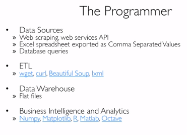
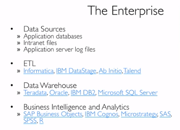
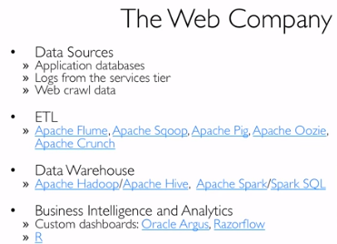

##简介
基本上一个Google Flu Trends以及之后它笨笨地把用户点击的自己预测出的新闻那些数据也roll out进最后导致预测结果不准就能说完了.还有一个新词,和forecasting对应的一个nowcasting,预测当前行为.
##大数据撕X
这个例子挺有意思,说有人从Google Trends分析了近几年来网友对myspace的搜索量,再根据myspace的现状建了个模,预测说facebook过几年就没了.然后facebook不高兴了也建模分析了一下说过几年普林斯顿就没了,再过几年地球也就没了,因为最近大家都不搜air这个词了.总结就是说好的模型需要考虑各种相关因素,但是这些相关因素也不一定能正确的反映原因(或者结果).
##与SQL数据库对比
数据科学里大部分数据是unstructured或者semi-structured,用NoSQL方便.电商网站可能会将用户基本信息存入关系数据库,但是将推荐信息存入NoSQL数据库中.数据科学中这两种结构的数据都会用到.
##ETL
extract data from sources (files, HDFL, logs, database)
load data into sink (各种语言)
transform data at the source, sink or in staging area
##Roles

