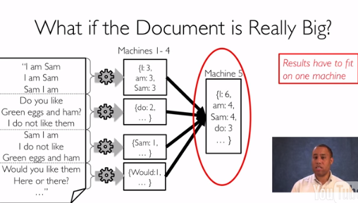
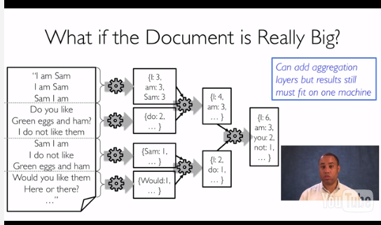
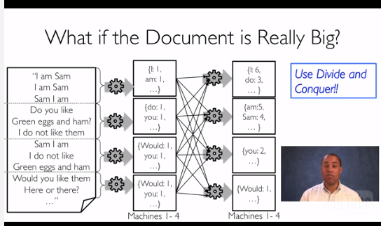
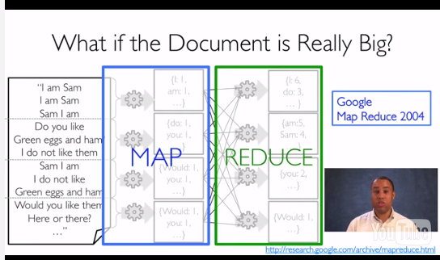

##数据中心
数据中心使用consumer-grade硬件,容易扩充,software复杂.
##怎么用cluster工作
计算term freq的例子,用Hash table,遍历,查询,更新.

如果数据很大怎么办?MapReduce,把所有文档分给不同的机器(做partition),最后把结果merge到一台机器上去.

如果这台负责存储的机器根本从不下怎么办,一种方法是再加一层merge的机器,最后一层再merge到一台机器上.

但这样还是会把所有的数据存在一台机器上,还是会出现存不下或者风险大的问题.

最后一种凶残的方法是divde and conquer,把最后的结果分布在许多机器上,每台机器只存一部分内容(内容可做排序).引入的两个性质叫idempotent and have no side effects, 这样一台坏了或者很慢就直接kill掉在新机器上重新计算.

这还是MapReduce.

##Spark快的原因
Spark使用RDDs,resilient distributed datasets
它处理的结果不需要写到disk上,所以结果不需要serialized.
它可以选择im-memory存储或者disk存储.容错能力强,自动处理慢或者faliure的机器.