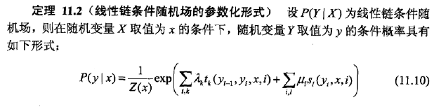
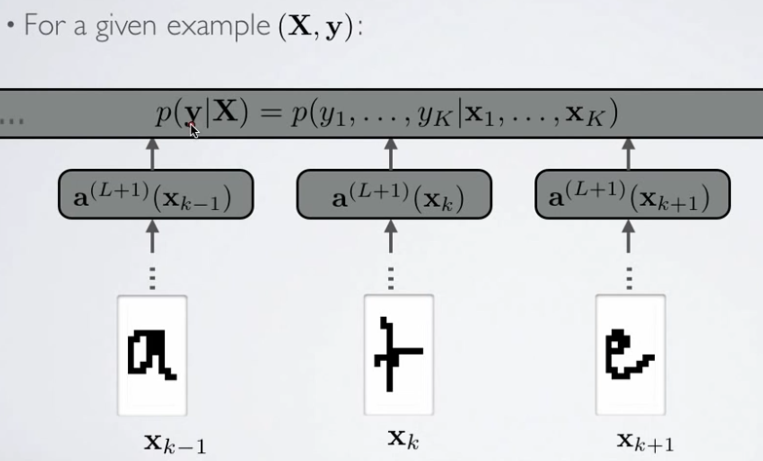
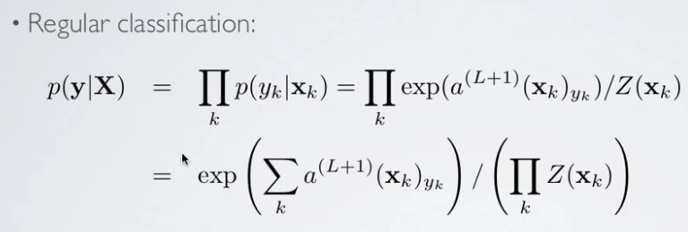
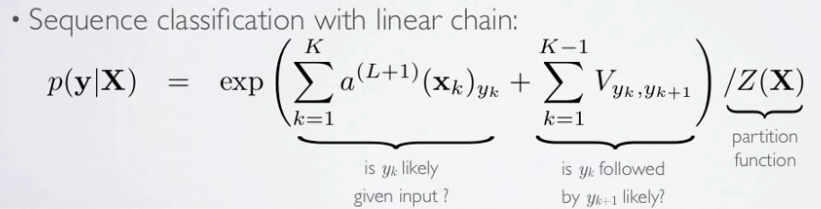
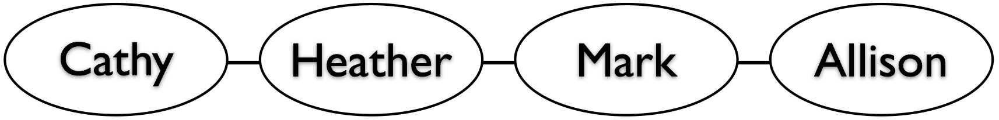

## CRF ##
### linear chain CRF ###
李航的统计学习方法里讲了CRF。对于线性链CRF，书上直接写出了这个公式。

对一个不懂图模型的人来说，怎么才能理解这个式子呢?国外有个大神小伙(小伙跟LeCun混的)在他的Deep Learning Tutorial里讲的CRF，可以解释一下这个式子。他的一系列教程都是基于神经网络的，没错，他的CRF也是基于神经网络讲的。

话说神经网络是个判别模型，就是说它输出的是所有的P(y|X),例如对于二分类问题,这个NN的输出就是P(1|X)和P(0|X).

对于序列预测问题,比如下面这个序列手写数字识别,

这里面的X和y的含义如下:

回忆下MNIST里的大小为28*28小图片,把它从矩阵展成一条向量x.如果写了K个连续字母要识别，那么X = [x1, x2, ..., xk], y = [y1, y2, ..., yk].

因为是序列，所以输入的顺序一定会影响结果. 但如果不考虑顺序(每个输入相互独立), 先实现一个baseline的神经网络的话, 这个神经网络的输出可以写成下面这样:

解释: 由于假设输入之间相互独立,那么序列的概率就是序列中每一个时间点上的概率之积. 然后每个时间点上的概率就是那个神经元的输出(就是softmax).

这个就相当于用神经网络每次输入一张图片,把每次的结果乘起来. 但很明显,这个序列标注问题里, 相邻的两个输出是互相有影响的, 这个只需要在概率公式里加上一项即可,这一项用来描述描述yk后面跟yk+1合不合理,有多合理.于是公式可以写成下面的:

形式已经和教科书上的公式很像了.

###无向图
可以通过下面这个例子来解释什么是无向图模型。

说有Cathy (1), Heather (2), Mark (3), Allison (4)四个同学，其中Heather和Allison同学学习好，他们答对一道题的概率是90%。Cathy和Mark同学学习差，他们答对一道题的概率是25%。

另外还有两个假设，1. 所有题目难度一样, 即一道题回答正确与否与题目本身不相关; 2. Allision和Heather不会把相同的题答错因为他们一起学习.

如果一场考试中,他们4个按照(1)(2)(3)(4)的次序坐下, 每个人都能看到周围(左右)人的答案, 每个人都会被左右的答案影响, 认为周围人的答案是对的.下面这张图就可以反映出这种情况.

因为大家可以看到周围人的，所以图中每两个人的最终答案都受到了影响，互相相关。无向图中，只要两个节点可以通过路径连接，它们就都是相关的。但同时，它们又是条件独立的，比如给定了Heather的答案时，Mark和Cathy的答案是相互独立的。
