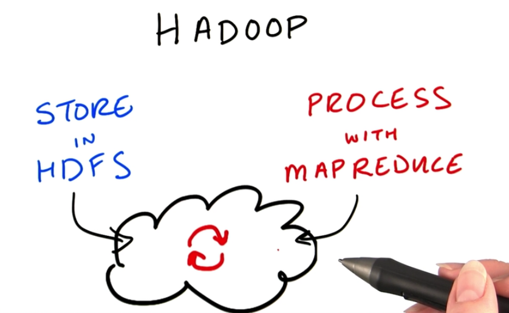

##1. In place

HDFS的存储和MapReduce的计算都发生在集群上,做In Place计算.
##2. 生态系统

为了让所有人(不会用Java,python写MR程序的人)都可以使用Hadoop, 就有了Hive和Pig两个解释性的脚本语言.
Hive和标准SQL语句有点像,PIG则是一种很简单的脚本语言,它们最终都会被翻译为MR代码在集群上执行.
所以其实这两个办法有点慢,特别是数据很大时,执行MR需要时间.
***
于是出现了不需要运行MR的Impala,通过Impala可以直接操作HDFS,速度是HIVE的几倍,因此常用语low latency query.

HIVE用来做长时间的处理工作.
***
Sqoop可以从传统的关系数据库,比如mysql中获取数据直接写如HDFS,从而可以和集群一起工作.

Flume更凶残,可以直接把外部系统中的文件写入HDFS.

HBase是一个建立在HDFS之上的real time数据库.

Hue是一个图形化前段,来操作cluster的.

Oozie是一个work flow 管理工具

Mahout是一个机器学习库.

CDH把这些东西打包了一起安装.
