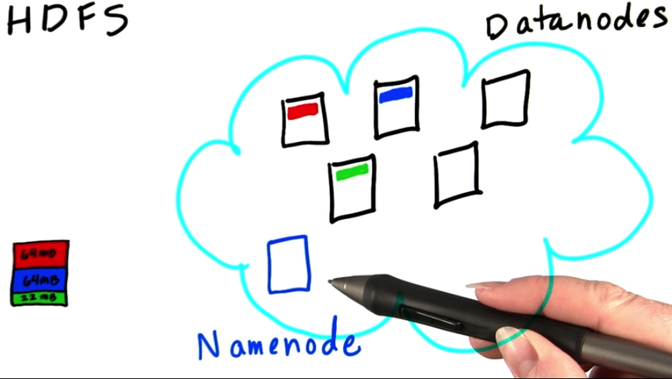
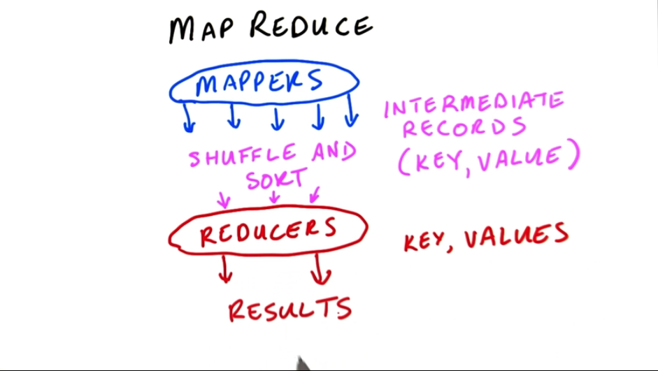
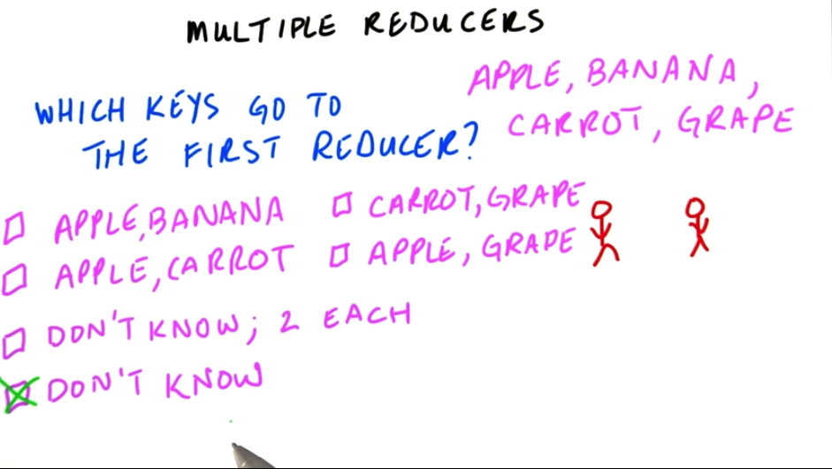

##1. NameNode和DataNode

数据分布在集群里,每个存一部分,称这些为DataNode.NameNode里存的是metadata,是各个部分的文件信息.
##2. 这样分布式地存储可能遇到的问题

##3. 数据冗余
为了防止DataNBode坏掉,每份文件都存3份.

但是如果NameNode坏掉,就要看情况了.

网络问题,暂时坏掉.如果是NameNode磁盘坏了,数据也就没用了.
一般有两个NAMENODE,一个active,一个stand by.或者通过网络NFS存储.
##4. MapReduce现实案例
###vs HashTables
一般做统计,比如销售额,可以用哈希表.但是费时间,内存.

MAPREDUCE在各个小部分数据上同时计算,最后再收集.

mappers输出的是中间结果(key, values)

然后shuffle and sort,交给reducer


##5.多个REDUCER,怎么分配工作

不知道...
##6.Job tracker和task tracker
任务会提交到JOB TRACKER,JOB TRACKER会把mapper和reducer 分给task tracker.一般都会在datanode上直接执行map reduce,除非这个node太忙,就会将数据通过网络streaming到其他datanode上去算.
Reducer会把最终结果写到HDFS上.

##7.用streaming写map reduce
udacity教程利用的cloudera的CDH,没装这个.按照官方文档下hadoop和streaming jar,配置单机的psuedo cluster.

sbin/start-dfs.sh启动hdfs

之后可以跑个map reduce的例子,
```
hdfs dfs -put input.txt input_hdfs #把输入文件放入hdfs
hadoop jar tools/streaming.jar -mapper /bin/cat -reducer /usr/bin/wc -input input_hdfs -output out
hdfs dfs -get out #把结果从hdfs中提取出来.
```