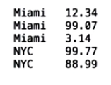

##1.MapReduce流程
map -> shuffle and sort -> reduce
reducer接收到的是这样形式的数据


##2.Mapper
```
# Your task is to make sure that this mapper code does not fail on corrupt data lines,
# but instead just ignores them and continues working
import sys

def mapper():
    # read standard input line by line
    for line in sys.stdin:
        # strip off extra whitespace, split on tab and put the data in an array
        data = line.strip().split("\t")

        # This is the place you need to do some defensive programming
        # what if there are not exactly 6 fields in that line?
        # YOUR CODE HERE
        if len(data) != 6:
            continue
        # this next line is called 'multiple assignment' in Python
        # this is not really necessary, we could access the data
        # with data[2] and data[5], but we do this for conveniency
        # and to make the code easier to read
        date, time, store, item, cost, payment = data
        
        # Now print out the data that will be passed to the reducer
        print "{0}\t{1}".format(store, cost)
        
test_text = """2013-10-09\t13:22\tMiami\tBoots\t99.95\tVisa
2013-10-09\t13:22\tNew York\tDVD\t9.50\tMasterCard
2013-10-09 13:22:59 I/O Error
^d8x28orz28zoijzu1z1zp1OHH3du3ixwcz114<f
1\t2\t3"""

# This function allows you to test the mapper with the provided test string
def main():
    import StringIO
    sys.stdin = StringIO.StringIO(test_text)
    mapper()
    sys.stdin = sys.__stdin__

main()
```
##3.Reducer
```[python]
import sys

sales_total = 0
old_key = None

for line in sys.stdin:
    data_mapped = line.strip().split("\t")
    if len(data_mapped) != 2:
        continue

    this_key, this_sale = data_mapped

    if old_key and old_key != this_key:
        print("{0}\t{1}".format(old_key, sales_total))
        old_key = this_key
        sales_total = 0

    old_key = this_key
    sales_total += float(this_sale)

if old_key is not None:
    print("{0}\t{1}".format(old_key, sales_total))
```