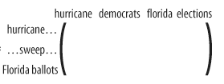
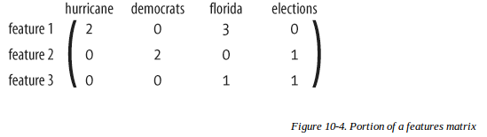
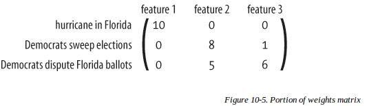
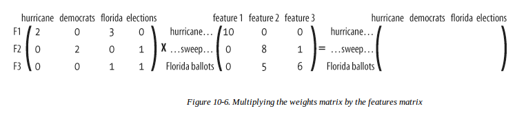

##独立特征
这一章讲的特征(新闻主题,及新闻主题是什么意思)和图像里的特征没任何区别.独立特征即一组正交积,所以本章的NMF可以用PCA或者词典学习甚至是自动编码器代替.
###数据格式
和图像一样,一个向量是一个样本,这个向量里每一项是词频,位置与另一个向量word对应.matrix每一行是一个新闻.
```
articles = ['A','B','C',...
words = ['hurricane','democrats','world',...
matrix = [[3,0,1,...]
          [1,2,0,...]
          [0,0,2,...]
                 ...]
```
###之前的聚类方法
之前的聚类方法也可以用.但聚类不能得到主题特征,每个类代表了什么需要人来看.
###NMF
非负矩阵分解,一个大居住分解为两个小的正矩阵相乘.两个小矩阵各有意义.从训练的角度来看,就是从数据集中训练出一组特征,通过这些特征的线性组合来恢复原数据.

文章矩阵(数据集)



特征矩阵,一行一个特征,一个特征和一个样本具有相同的形式(不然怎么线性组合)



权值矩阵,就是线性组合的系数.



NMF就是这么个东西.



###结果呈现
这么算出来的特征,一个特征中的每一项不在代表词频(但和词频还有一定关系),它用来指示每个单词应用到该特征的程度.所以显示一个特征的时候,取出值较大的几个单词就能表示这个特征的意思了.
系数矩阵,可以看成一个特征应用于每一篇文章的权重值(虽然这样想比较别扭),所以对于这个特征,显示出它对应的权值最大的三篇文章.这两个就可以观察出一个特征是什么意思了.
###以文章形式呈现
还可以列出一个文章的三个系数最大的特征(主题).
