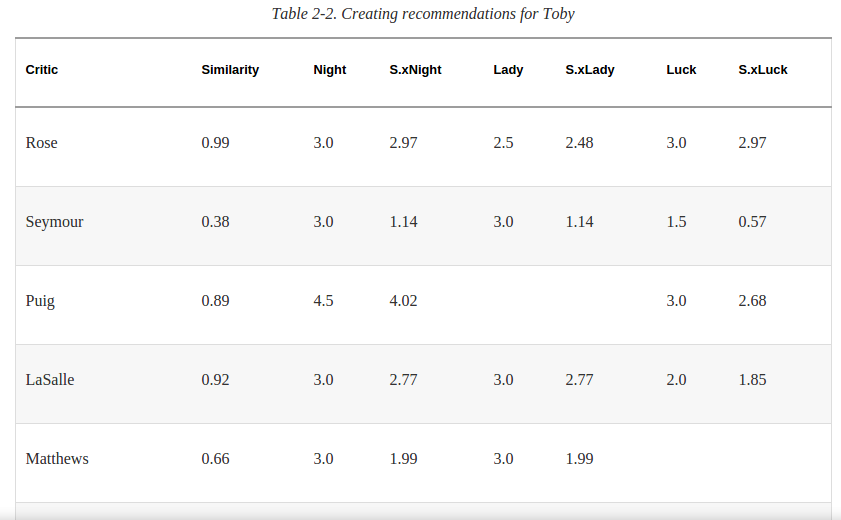
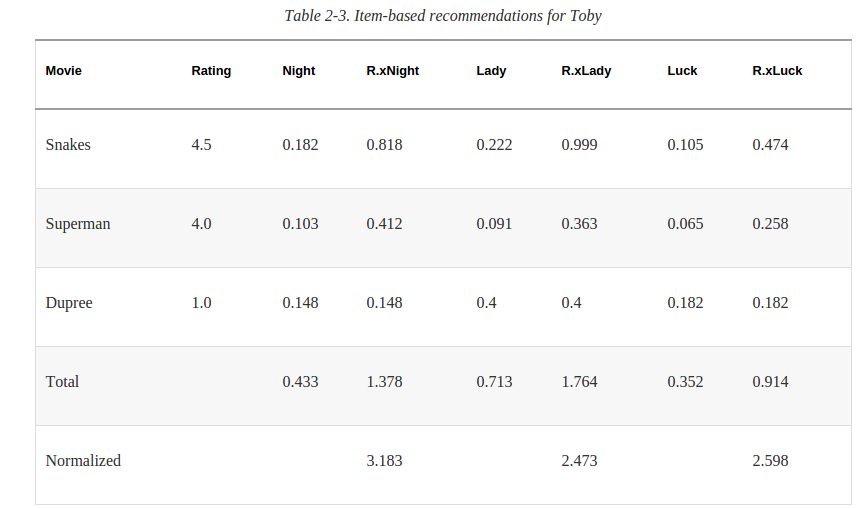

##1. 用户相似度
用户对电影作出评分,怎么计算两个用户之间的相似度?看两个用户的共同喜好.如果两个用户没有标记过(评分)任何相同的电影,也认为他们是相似用户.如果他们有共同评分过的电影,那么把一个用户表示成这些共同电影的评分的向量.如user1 = [3,3,5,2],
user2= [4,4,2,2],顺序是电影.那么就能够计算他们的距离了.距离越大说明不相似.
距离可以用欧式距离(注意相似度应该和距离成反比,所以要考虑分母(距离)为0的情况),也可以选择Pearson Correlation Score,后者考虑到了这种情况,[1,2,3,4],[2,3,4,5]这两个应该是相似的,因为这两个用户对电影的评分趋势是一样的,只是一个习惯给的整体偏高.
有了相似度就能计算喜好类似的用户了.
##2. 推荐电影TopN
怎么给一个用户推荐电影,这个就有点collective filter的感觉了.先找到相似的用户,每个相似用户对应这他们的电影评分列表.然后用该用户的相似度去乘每个电影的评分.最后针对每个电影(因为对后要推荐的是电影),累积这些相似用户对它的加权评分,除以这些用户的相似度,得到的这个值就能作为是否给用户推荐的指标了.这个指标很神奇的也就是预测该用户可能对这电影的评分.

##3. 相似物品
之前的数据是一个用户,对很多电影的评分,把这些数据变形一下就是一个电影,很对用户给出的评分.就是将用户和电影对调.然后用相同的算法topMatches得到的就是相似电影.
之前可以给一个用户推荐TopN电影,现在同样也可以对一个电影推荐TopN用户,这TopN用户并没有看过这个电影,但可能会给出高评分.
##4. 基于物品的推荐,构建相似物品表
之前的算法都是针对某一用户的每一次推荐,要在全体用户,全体物品里计算.其实相似物品可以离线算出,然后直接使用结果,只需定期更新即可.
构建相似物品表很简单,对每个物品计算Top相似度.最重要的是,这个可以离线直接使用不用再计算.
##5. 基于物品的推荐,获得推荐.

先找到user看过的(评分过)的电影,对所有这些电影去寻找相似电影(直接查表),对这些相似电影计算加权评分(如果这个相似电影用户已经看过就忽略它),再做个归一化就得到预测评分,可以推荐了.
这里面没有用到其他用户的信息,完全是基于物品的推荐,.
