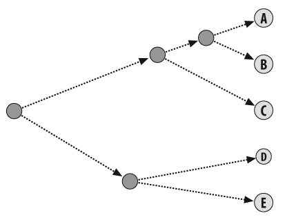

##对博客聚类
一个博客转为一组特征值,特征值就是词频.单词列表是去除了stop word的,去除的方法也用了比较简单的方式,统计某单词在所有博客中出现的频率,只保留[0.1, 0.5]的.
##分级聚类
hierarchy,聚出来是一棵树.

首先认为每个博客是单独一个类,遍历寻找这100个博客中距离最近的,作为一个类并将其合并,合并后的特征值就是平均值,然后再遍历.
这种聚类计算量大而且新数据进来后要重新算一般不用.
##聚类的特点
刚数据项的数量比变量多的时候,出现无意义的聚类的可能性就会增加.由于单词的数量比博客多很多,在博客聚类中出现的模式要比单词聚类中出现的模式更为合理.
##KMEANS
方便的聚类
##另一种相似性度量方式    Tanimoto
之前的欧式距离和Pearson Correlation适用于评分类型的数据,tanimoto适用与单纯的[0,1]数据,比如标记物品.
[1,0,0,0,0,0,1,1],表示这些物品中有3件是标记的(想要的),其它是没标记的.
Tanimoto的计算: 用两个人都想要的物品数目(交集),除以两个人分别想要的物品数目之和(并集).