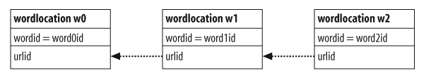

##爬虫
首先有一个url列表,对里面的每个url,下载它的html,将这个网页加入索引,同时找到这个网页里所有的link,检查这些link是否索引过,加入一个新的列表.这样重复几次(depth),就可以广度遍历到depth层的网页.
##索引
就是建立数据表.

link表记录网页之间的跳转关系.
urllist记录所有的url.
wordlist记录所有的word.
wordlocation记录某单词在某url中出现的位置.
linkwords记录每个url里对应的word.
##查询,返回匹配的urlid,以及匹配单词的位置.
多词查询,针对每个单词都要查.

比如查询了w0和w1,对应的查询语句是这样的.
查询结果为(urlid, 单词0的位置, 单词1的位置)
```
select w0.urlid,w0.location,w1.location
from wordlocation w0,wordlocation w1
where w0.urlid=w1.urlid
and w0.wordid=10
and w1.wordid=17
```
##排序,基于内容的排序
之返回结果对用户来说很不方便,因此还需要对结果进行排序.分为基于内容的排序和基于行为的排序.
但这里没有用TFIDF.
##单词频度
对于多次查询返回的匹配的行与位置进行处理,统计词频,排序后能够将词频高的url放前面.
##文档位置
对与查询的单词,统计所有出现位置的和,越小就说明这些单词越靠前,得分就越高.
##单词距离
查询的各个词之间应该距离相近.