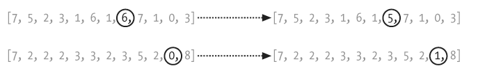
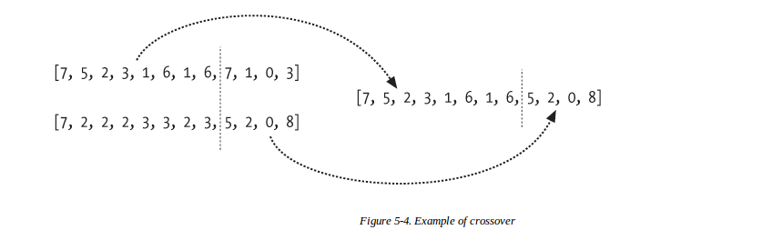

##代价函数
优化是寻找一组解让代价函数最小.
旅游问题的代价函数,统计了各种消耗的时间,并转化成钱,加上路费组合成的代价函数.
##baseline 随机搜索
在旅游问题中,解的可能有10的12次方种.随机搜索是随机给出一组解,从这里面找到代价函数最小的.比如给10000个解,找到代价最小的.这样虽然不是最优的,但也还算不错.
之所以是baseline,是因为方法naive,而下面的较好方法也都使用了部分随机值.
##爬山法
和梯度下降很像,但是不用梯度,而是在一个解周围去寻找和他相近的解,找到最优的,换成这个,再继续在周围寻找.
缺点也和梯度下降一样,容易掉入局部极小值,解决方法是多次随机初始化试图避开坑.
##模拟退火
金属温度高时,大量原子受到激发而跳跃,也就是说温度高时参数应该更新的较快,温度低时更新慢.
爬山法每次迭代都期望得到一个更好的解,虽然这个更好的解其实可能在坑里.而模拟退火刚开始时会接受表现较差的解,因为
温度高原子活动剧烈.随着温度下降,最后就几乎只接受更好的解了.
模拟退火寻找解和爬山法类似,但每次之更新解的其中一维,即只在解的一个维度(随机找的)上面作出一点浮动.
算法退出是当温度下降到某值时.
```
if (current_cost < cost or random.random()<pow(matn.e,-(current_cost-cost)/T)):
    vec = vecb # update solution
```
##遗传算法
和随机法也差不多,只不过用了好听的名字(从生物学来的).首先还是随机初始化一组解,将得到的代价函数排序,较小的对应的解称为精英(随机出的精英..),之后用这些精英,通过变异,比如配对或者交叉,其实就是从这个解里取一部分,从另外一个里取一部分拼成一组新的解,再计算,排序,变异,直到一定的次数或者代价函数不减小了就结束.

变异


交叉
##优化算法的应用举例
以前虽然常用优化算法,但目的比较简单,就是寻找方程的解,或者方程的参数.这书里的举的三个应用实例第一次见还真是觉得神奇.
###旅游航班制定问题
用数值优化方法解决一组人如何选择航班的问题.
一组人要去同一目的地,还要离开,优化算法可以找到一组解(每个人的行程)使得代价函数最小.
###学生宿舍分配
10个学生,5个宿舍,每个学生有一个首选宿舍和一个备选宿舍,优化算法能找到代价函数最小的宿舍分配方法.
###网络可视化
许多联系人,画出他们的社交关系.直接画的话不可避免地会出现很多交叉,不容易看,在代价函数里加入交叉惩罚(还有两个点距离太近的惩罚,夹角太小的惩罚),用数值优化方法就能画出比较好看的社交网络图.