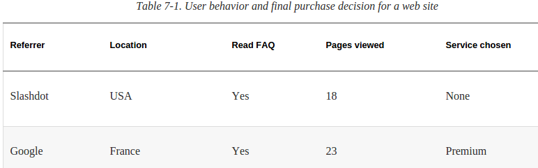
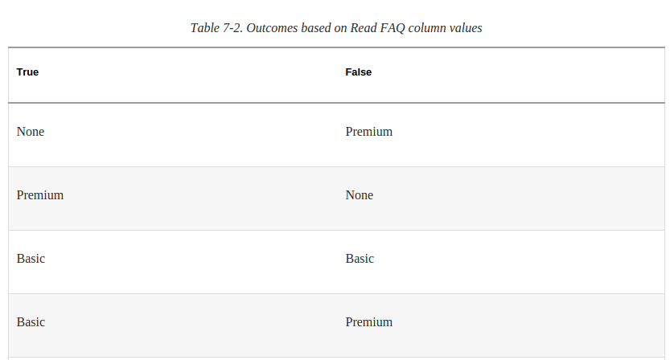
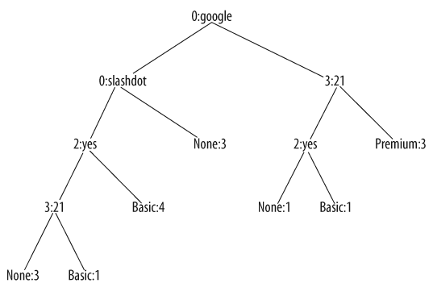

##决策树
决策树是一系列的if-else演化出来的二叉树.它的结果可以是离散的分类结果也可以是连续的数值结果(回归).它适用于这种情况:输入的数据里既有分类又有数值信息,不适用于全都是数值的情况.
比如通过用户信息来预测它是否会购买服务.下图是训练数据,有离散有连续.

每一个节点都包含了如下信息:判断项(特征中的某一个),value(判断指标,针对与当前节点的判断项),tb,fb是当前节点分出来的true和false对应的节点,results,除了叶子节点其他都是None,叶子节点上保存的是针对当前分支的结果.
###训练
直观上就是拆分数据,由某一个特征开始if else判断.比如最简单的,从所有特征中选一个来做if else,true分一类,false分一类,这样结果没有什么意义.如下图,是随便选的.可以看到我们想知道的事情(如果什么什么是真,那么这个用户会购买服务)并没有很好的分开.

所以这不能随机选,应该通过某种指标来决定每一个节点上是什么判断项,一般有三个指标,针对离散预测的有基尼不纯度和熵,连续数据的是用方差.
###熵
熵比较好解释,熵越小表示系统越有序.我们想通过数据训练出一个稳定的判断系统,所以构建树的时候每一步都要让熵小(这个条件可以放宽).
基尼不纯度和这个意思差不多,就是要让分类结果的target尽量都是同一类.
###训练,构建
每一步计算信息增益,决定从哪拆分.
###显示
###用决策树来判断新样本

就是遍历一遍,计算出所有节点上的数值.
###剪枝
决策树也会过拟合,如果"决策"太多的话.它的防止过拟合的方法是剪枝,就是将某些分支合并.策略是先建好整棵树,再消除多余节点.方法是对具有相同父节点的一组节点进行检查,如果将其合并后熵的增加量小于某个阈值就把它们合并.
###处理缺失数据
样本特征中某些字段缺失时,应该两个分支都走,对结果加权,
###处理数值型结果
把熵换成方差.