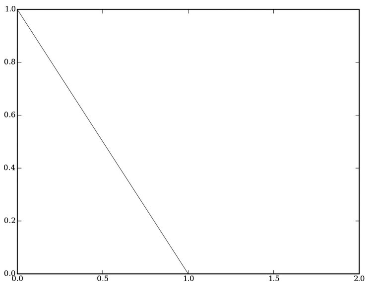
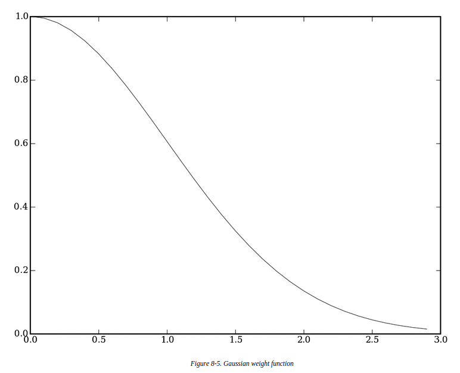
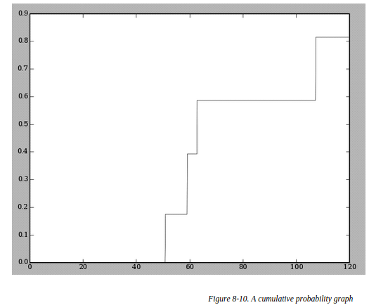

##价格模型
本章的价格模型接受一组特征参数,返回一个商品的价格.
###最简单的模型
假设葡萄酒价格只和年限和等级有关,则价格就是这两个变量的线性组合.
###kNN
找到一个新样本的k个具有相似特征的样本,对这k个样本的价格求平均就是新样本的价格.这里就要用到相似性的度量.
最容易理解的是两个样本距离越远相似性越小,距离为0则相似性越大.所以可以将相似行定义为距离的倒数(由于会出现1/0的情况,所以要在分母上加个常数).
还可以用hard-threshold方法,当距离大于某个值后就认为是0了.

最好用的相似性度量函数是高斯函数,原因是以上两个方法在距离很远时相似性就为0了,而且倒数方法在距离接近时相似性会非常非常大(参考1/x的函数图像),而高斯函数在始终不会为0.

有了权值,计算新样本价格的时候就不在是直接求平均值,而是加权平均,这样的kNN也叫weighted kNN.
###交叉验证
整个样本集随机分为95%训练,5%测试.一共做出10组来,求出测试集上的cost均值,这个cost能够反映模型好坏.其实这里说的模型只是指k选择多少合适,kNN模型就没有参数上来就用整个数据集计算.
###不同类型的参数
有的参数本来数值就大,这样如果两个样本的这项特征差了一点导致结果是整个距离会差很远,导致kNN不准确.还有的特征根本没用,比如葡萄酒特征里可能会有一项葡萄酒存放的通道号,这个对价格没有影响,却会产生距离误差.
解决办法是分别对每一维进行缩放.可以看作是归一化的升级版.对于数字比较大的特征乘以较小缩放因子,没用的特征乘以0.
寻找这些缩放因子的方法完全可以照搬优化算法的方法,比如退火,遗传算法.
```
>>> optimization.annealingoptimize(numpredict.weightdomain,costf,step=2)
[11,18,0,6]
```
优化算法能够计算出哪些特征重要哪些不重要哪些没用.
###估计概率密度
之前都是直接估计出价钱,还应该估计出属于某价格区间的概率.实际上就是对k个近邻的价格是否在区间内进行统计.
可以把结果画成概率累计函数

