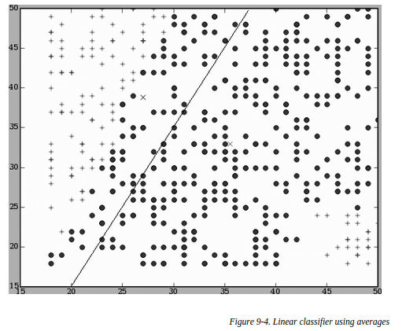
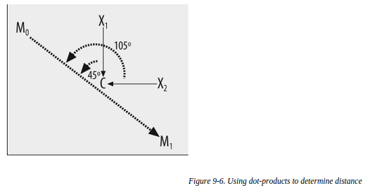

##核方法
之前还以为核方法只在SVM里面用到,原来它比SVM早出现.
婚介问题,一个样本是一男一女的数据并起来,target是1或者-1,表示可约与不可约..
男女的数据,由于有类似年龄这种数值型的,也有爱好这种非数值型的(分类型),所以要先处理一下.对于非数值的特征,比如爱好,可以读取两人的兴趣列表,计算里面相同的个数.
###基本的线性分类器
先简化特征,只看男女年龄.
计算所有正样本和负样本的均值,得到两个中心,这两个中心就能够作为一个线性分类器了.
下图两个x是样本中心,中间的分割线是这样画出的,所有直线左侧的点,更接近于不匹配,右边的接近于匹配.

这样新来一个样本看它在左在右即可.
###点积
以前计算两个样本相似性需要计算距离,如欧式距离,其实还可以直接点乘.
如下图,M0,M1是两个类中心(均值点),C是其中点,X1,X2是两个样本,通过点乘结果是正是负就能判断属于哪个类.

###特征归一化
  # Create a function that scales data
  def scaleinput(d):
    return [(d.data[i]−low[i])/(high[i]−low[i])
             for i in range(len(low))]
###核方法
加入是二维数据,明显不可分的那种,其实只要做的坐标变换就能看到分开的可能了.以前两个样本的点积运算,如果换成一个新的函数(核函数),借助这个函数可以完成:将数据映射到高维的空间,并且返回高维空间中的点积结果.这样就能分了(可以接着用以前的线性分类器,不过要加入offset,因为高维空间计算出的点积可能有点大,正例和负例的结果不能和0比了,要和一反而0ffset比较).
###支持向量机
大间隔分类器,只用那些模棱两可的样本,称之为支持向量,来计算出一条最大间隔的分割线(平面).
